# StoreManager
Site Web pour gérer l'inventaire et les ventes d'un magasin.

*Website to manage inventory and sales of a store.*

## Usage
### Page Transaction/Acceuil
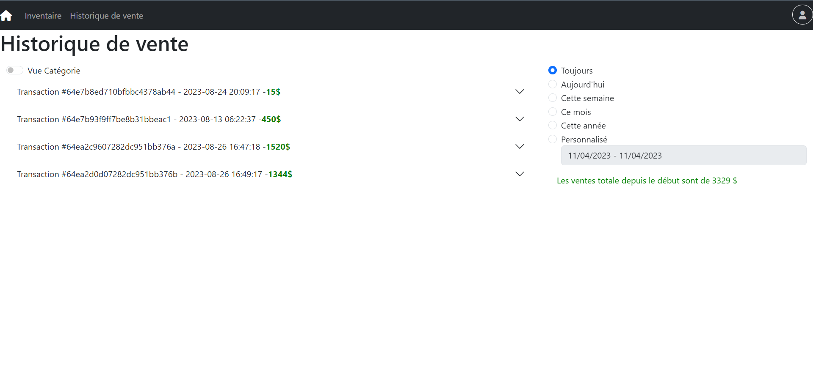
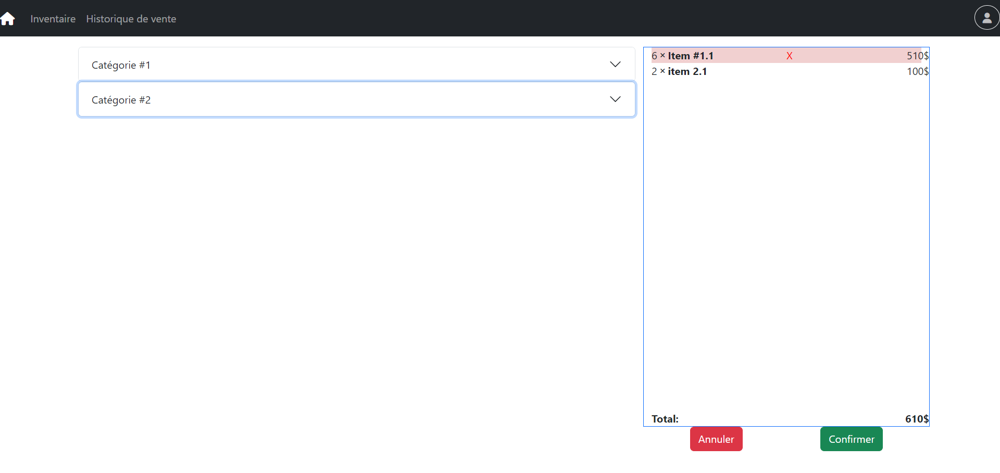
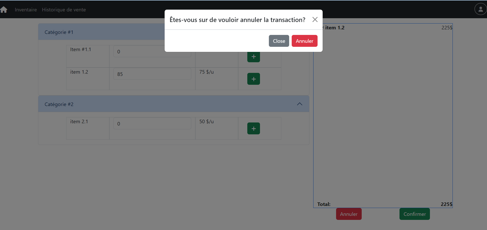
### Page Inventaire
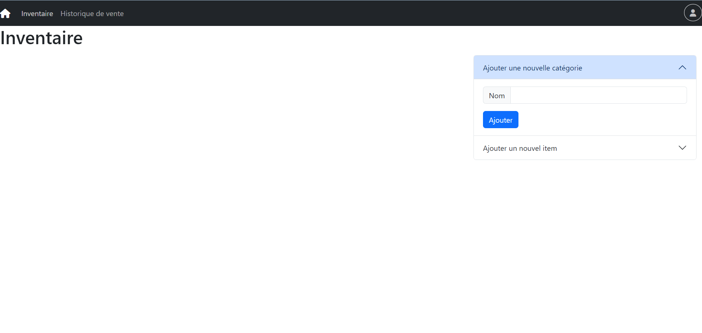
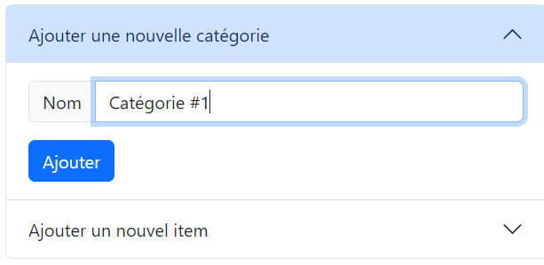
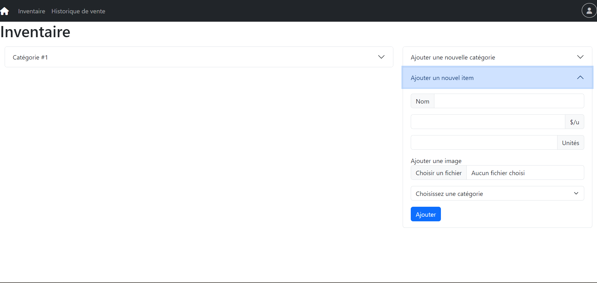
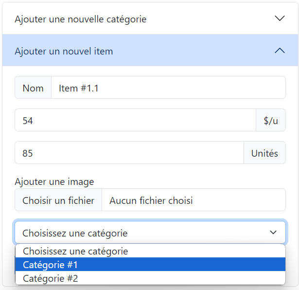
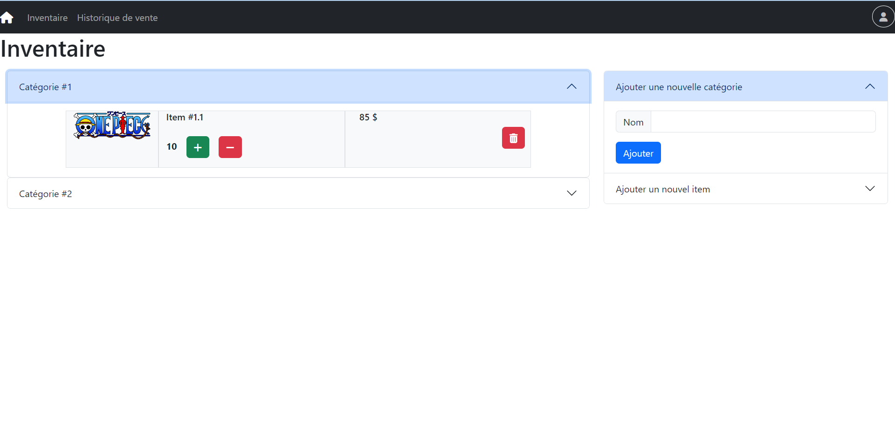
### Page Historique de ventes
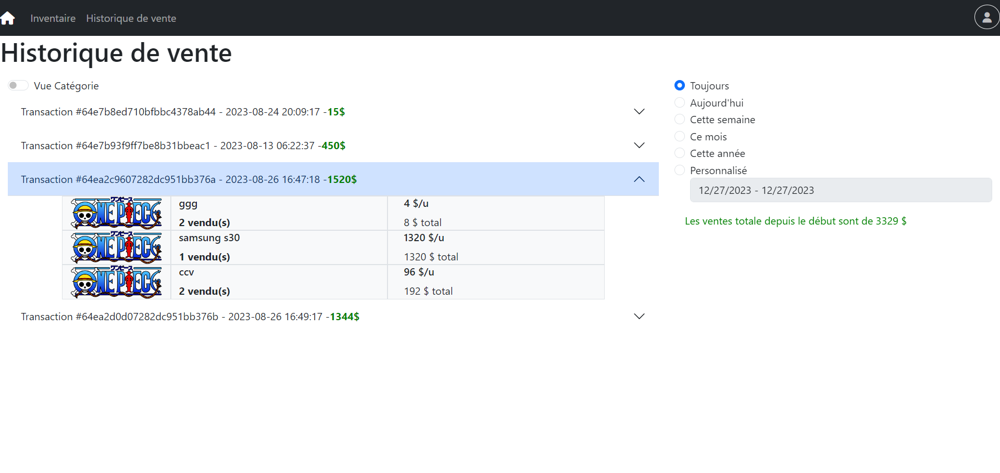
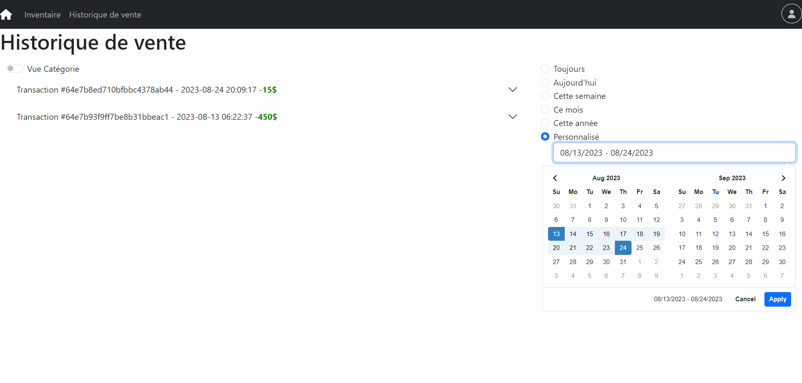
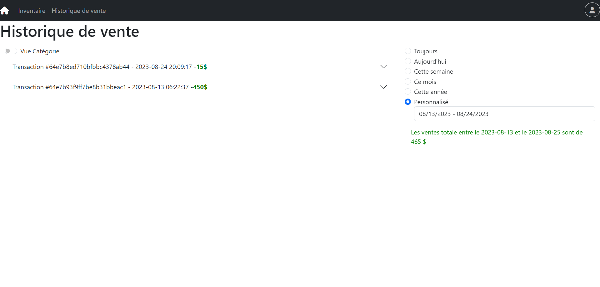

## Technologies
### Front-end: 

### Back-end:

## Piste d'évolution
- Ajouter un système de login pour modifier l'inventaire
- Gestion des images pour les items

  

- *Add a login system to modify the inventory*
- *Manage images for items*

## Credits
La base du code est dérivée du projet intégrateur de génie logiciel de deuxième année à Polytechnique Montréal.

*The code base is derived from the second-year software engineering project at Polytechnique Montréal.*

*Date Range from the transaction page is from* <a href=https://www.daterangepicker.com/> DateRangePicker</a>