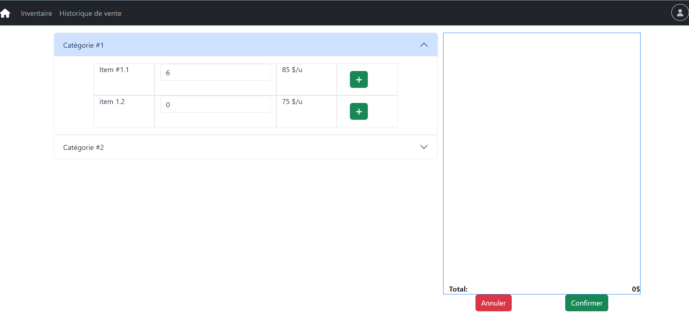

Readme in progress
# StoreManager
Website to manage inventory and sales of a store.

# Usage

## Technologies
### Front-end: 

### Back-end:

## Crédits
The code base is derived from the second-year software engineering course project at Polytechnique Montréal.

Date Range from the transaction page is from <a href=https://www.daterangepicker.com/> DateRangePicker</a>